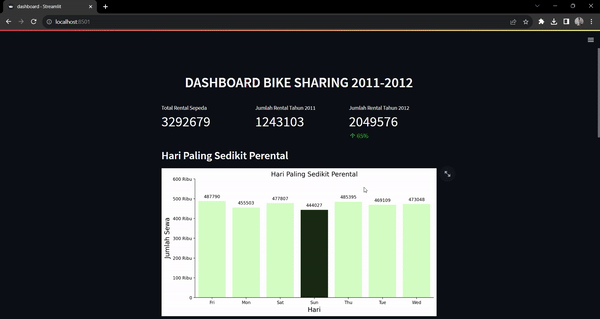

# Bike Sharing Data Analysis with Python - Dicoding
[Bike Sharing Data Dashboard Streamlit App](https://dinarna-submission-analisis-data-dengan-python-dashboard-2ao1um.streamlit.app/)




## Overview
Proyek ini merupakan proyek analisis dan visualisasi data yang berfokus pada data publik Bike Sharing.

## Installation
1. Kloning repositori ini:
```
git clone https://github.com/Dinarna/Submission-Analisis-Data-Dengan-Python
```
2. Install Package Python yang diperlukan dengan menjalankannya:
```
pip install -r requirements.txt
```

